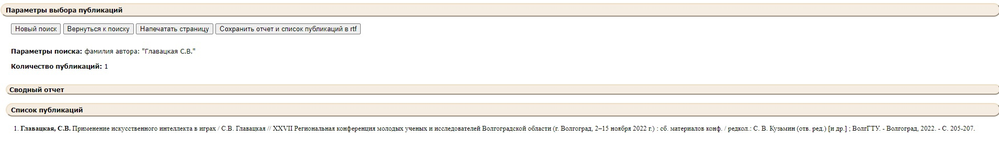

## В данном репозитории представлены файлы и ссылки на документы, связанные с созданием выпускной-квалификационной работы на тему: "Разработка хоррор игры с использованием ИИ преследователя". 
### Разработчиком данной игры, является студентка Волгоградского Государственного Технического Университета, факультета электроники и вычислительной техники, группы ИВТ-465, ***Главацкая Софья Владимировна***
+ Вся документация хранится на google disk в электронном формате по адресу: [Диск с файлами](https://drive.google.com/drive/folders/1M2DxSfArPNMR7Jf72ocKCYPD0tzLARwo?usp=share_link)
+ Ссылка на папку с файлами игры и прототипа: [Game_File_Drive](https://drive.google.com/drive/folders/1WjGYKQFWpgV5GWJhHB97EZZWsGGoGamx?usp=share_link)
+ Дизайн-документ представлен в данном репозитории с расширением .pdf, а также его можно прочитать здесь: [Дизайн-документ](https://docs.google.com/document/d/19EyUOScNxvx73YKZrhxqUZdmNt0Yszb1k2QCXRXGdhg/edit)
+ По теме ВКР также были написаны публикации, посмотреть их можно тут: [Публикация по методам ИИ](https://drive.google.com/drive/folders/1BlTzVMvPBMTL5iG6IhpR2I39A72fqIPY?usp=share_link) и [Публикация по теме ВКР](https://docs.google.com/document/d/1A-xFfwDWKlfuLeDfIVeuFxKRP7KHD8T_4-r33WIfm7U/edit?usp=share_link), а также они существует на сайте библиотеки ВолгГТУ [Library_VSTU](http://library.vstu.ru/)

+ Файл ТЗ хранится по данному адресу [ТЗ](https://docs.google.com/document/d/1xZujccvOd6E_w-PFKEx_dJ6zA83LKipU/edit)
+ Файл ПЗ хранится по данному адресу [ПЗ](https://docs.google.com/document/d/1KDL00usfFFaBSXuffdM98uvN2CnuXR-6uQSJgzpBb_M/edit?usp=share_link)
+ Референсы для локаций можно посмотреть по адресу: [Локации](https://drive.google.com/drive/folders/1ooyqS_C1eY3pAhUp2gorhiRV9x7Irn5p?usp=share_link)
+ MindMap: [Mind](https://www.mindmeister.com/map/2546883277?t=8XxDIB7JMs)
+ Проект, где проводились испытания ИИ и отработка механик, представлен в папке [Prototype](https://github.com/sofaglavaa/Diplom_GLava/tree/main/Prototype)
+ Сам **проект ВКР** представлен в папке [Game_file](https://github.com/sofaglavaa/Diplom_GLava/tree/main/Game_file/Assets)
